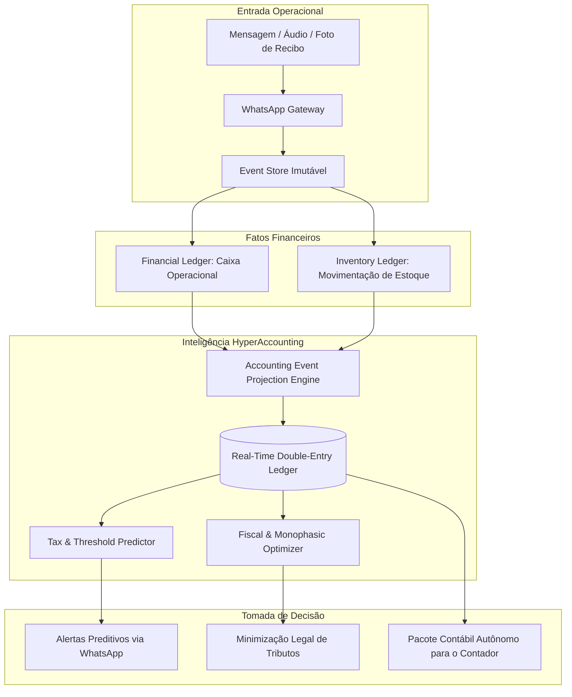
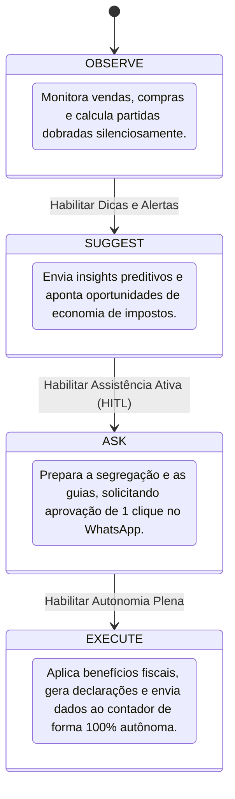

# MyChappie.Digital HyperAccounting — Módulo Contábil Preditivo e Otimizador

> **Status:** Especificação Arquitetural e Contrato de Módulo  
> **Camada:** Inteligência Contábil, Fiscal e Patrimonial (Fase 2 / Módulo 22+)  
> **Ecossistema:** AllasCode / MyChappie.Digital  
> **Arquitetura Base:** Event Sourcing, CQRS, Actor Model, Semantics-as-Code, Zero-Trust Auditability

---

## 1. Visão Geral do Módulo

O **HyperAccounting** é o módulo contábil autônomo, preditivo e prescritivo da plataforma MyChappie.Digital. Enquanto softwares de gestão tradicionais (ERPs e sistemas contábeis convencionais) operam **olhando pelo retrovisor** — gerando balancetes, guias de impostos e DREs de 30 a 60 dias atrás de forma puramente declaratória e manual —, o HyperAccounting atua como um **copiloto contábil em tempo real e de futuro antecipado**.

Ele transforma a contabilidade de um fardo burocrático em uma **arma estratégica de preservação e alavancagem de caixa** para micro, pequenas e médias empresas que não possuem computadores de mesa e operam o negócio prioritariamente via **WhatsApp** (por texto, áudio e fotos de comprovantes).

### Pergunta Norteadora de Valor (Critério Mandatório do Sistema)
> **“Qual decisão o usuário consegue tomar melhor depois que este módulo existe?”**  
> *O comerciante sabe com semanas de antecedência exatamente quanto pagará de tributos e provisões, quando corre o risco de mudar de faixa tributária ou estourar o MEI/Simples Nacional, e tem suas notas, compras e lucros automaticamente otimizados para pagar legalmente a menor alíquota tributária possível sem nenhum trabalho manual de digitação.*

---

## 2. Alinhamento com os Critérios Mandatórios da Plataforma

Seguindo as diretrizes fundamentais da plataforma, o HyperAccounting cumpre rigorosamente todos os critérios de existência de módulos de alto valor:

| Critério | Status | Implementação no HyperAccounting |
| :--- | :---: | :--- |
| **Armazena dados do domínio** | **Sim** | Plano de contas dinâmico, partidas dobradas, livros fiscais (Diário/Razão), provisões, tabelas de alíquotas (NCM, CEST, PGDAS, IBS/CBS) e regras tributárias. |
| **Produz informação derivada** | **Sim** | Balancetes e DREs dinâmicos em tempo real, regime de competência derivado de fluxo de caixa, balanço patrimonial vivo e índice de liquidez contínua. |
| **Possui inferência/decisão** | **Sim** | Classificação contábil automática de eventos (débito/crédito), identificação de bitributação indevida e escolha do regime tributário ideal. |
| **Possui IA, otimização ou algoritmo** | **Sim** | Redes neurais/séries temporais para predição tributária e Programação Linear/MIP para segregação tributária monofásica e otimização de Fator R. |
| **Produz valor operacional mensurável** | **Sim** | Redução imediata de 20% a 60% no PGDAS-D através de segregação de produtos monofásicos e eliminação de multas e juros por atraso. |
| **Pode automatizar decisões/ações** | **Sim** | Modos Semi-autônomo e Autônomo com envio automático de fechamentos, aplicação de benefícios fiscais e alerta de retenção. |
| **Pode ser operado pelo WhatsApp** | **Sim** | Consultas em linguagem natural ("quanto vou pagar de imposto mês que vem?"), relatórios visuais (PNG/PDF) e comandos de aprovação de 1 clique. |
| **Capacidade rara/incomum** | **Sim** | Contabilidade de Partidas Dobradas projetadas em tempo real a partir de eventos brutos de mensageria, com auditoria reversa até o áudio/recibo original. |
| **Feedback contínuo (Machine Learning)** | **Sim** | Autoajuste das heurísticas de classificação contábil com base no feedback do contador e conferência dos fatos fiscais. |

---

## 3. Arquitetura de Fatos: A Transição do Financeiro para o Contábil

No ecossistema MyChappie, o **Ledger Financeiro** acompanha o dinheiro da operação (*"Entrou R$ 60,00 via Pix"*, *"Saiu R$ 500,00 para fornecedor"*). 

O **HyperAccounting** constrói a **camada de integridade patrimonial e de competência** sobre esses acontecimentos, projetando os lançamentos de partidas dobradas imediatamente a cada evento da `EventStore`:



---

## 4. Funcionalidades de Fundação & Motor Contábil em Tempo Real

Para superar as barreiras dos sistemas convencionais, o HyperAccounting estabelece uma base de dados contábeis contínua e imutável:

### 4.1. Real-Time Double-Entry Projection (Partidas Dobradas Autônomas)
- Converte todo e qualquer evento de negócio (`PurchaseReceived`, `SaleConfirmed`, `PaymentCaptured`, `StockLossRecorded`) em lançamentos de Débito e Crédito instantâneos.
- Exemplo automatizado:
  - Na confirmação de uma venda de cerveja no balcão:
    - `DÉBITO`: Ativo Circulante / Caixa ou Meios de Pagamento a Receber.
    - `CRÉDITO`: Receita Operacional Líquida de Vendas.
    - `DÉBITO`: Custo das Mercadorias Vendidas (CMV).
    - `CRÉDITO`: Ativo Circulante / Estoque de Mercadorias.
- Não requer digitação manual de plano de contas ou parametrização complexa pelo lojista.

### 4.2. Plano de Contas Semântico e Auto-Adaptativo
- Compreensão ontológica do vocabulário informal do pequeno comerciante.
- Mapeia termos falados em áudio (ex: *"paguei a moça da faxina"*, *"comprei sacola de plástico"*, *"troquei a lâmpada do bar"*) diretamente nas contas contábeis correspondentes (*Despesas com Serviços de Terceiros*, *Material de Consumo e Embalagem*, *Despesas com Conservação predial*).
- Adaptação setorial automática (bares, restaurantes, mercearias, barbearias, pequenas oficinas).

### 4.3. Reconciliação Contínua Fato Contábil vs. Fato Financeiro (Accrual vs. Cash)
- Gestão simultânea do **Regime de Competência** (quando o fato gerador ocorreu) e do **Regime de Caixa** (quando o dinheiro efetivamente transitou na conta ou maquininha).
- Identifica vendas a prazo, vendas via crediário ("fiado"), adiantamentos de clientes e faturamentos faturados a fornecedores com prazo de pagamento, apurando DRE real e DRE fiscal sem distorções.

### 4.4. Diário e Razão Contábil Vivos (Live Journal & General Ledger)
- Elimina o fechamento mensal como evento pontual doloroso. O Diário e o Razão estão sempre fechados e em equilíbrio a cada segundo.
- Suporte a consultas instantâneas no formato de balancete analítico ou sintético gerado em microssegundos.

---

## 5. Funcionalidade Preditiva Obrigatória em Destaque

### 🔮 Motor de Previsão de Carga Tributária e Risco de Desenquadramento Fiscal (`Tax Threshold & Bracket Forecaster`)

A funcionalidade preditiva central do HyperAccounting utiliza **modelagem probabilística e regressão de séries temporais** para antecipar o impacto tributário futuro antes que o mês contábil se encerre.

#### O Problema de Mercado que Resolve:
No Brasil (e em mercados similares), os regimes tributários de micro e pequenas empresas (como MEI e Simples Nacional) são calculados com base no faturamento acumulado dos últimos 12 meses (RBT12). Quando o comerciante ultrapassa uma das faixas de receita, sua alíquota de imposto sofre um aumento abrupto e retroativo em cascata, ou ele é compulsoriamente desenquadrado do MEI para ME (com salto brusco de custos com INSS, folha e contabilidade), descobrindo isso apenas no dia 20 do mês seguinte, ao receber a guia de imposto já com valor inesperado.

#### Como a Funcionalidade Opera:
1. **Modelagem de Tendência e Sazonalidade:** Cruza o histórico de vendas diárias, previsões do módulo de Demanda (`Demand Prediction`), eventos locais e faturamento dos últimos 12 meses.
2. **Projeção de Curva de Faturamento:** Calcula intervalos de confiança para os próximos 30, 60 e 90 dias de receita bruta.
3. **Cálculo da Alíquota Efetiva Preditiva:** Simula dinamicamente a taxa exata do DAS (Documento de Arrecadação do Simples Nacional) do mês subsequente, informando com antecedência qual será o montante em Reais a ser provisionado.
4. **Detecção Antecipada de Ruptura de Limite (MEI / Faixas do Simples):**
   - Emite alertas proativos quando a curva aponta probabilidade superior a 80% de atingir o teto de faturamento.
   - Aponta a data provável do estouro: *"Se mantiver o ritmo atual, em 17 de novembro você ultrapassará o teto do MEI em R$ 4.200,00"*.
5. **Prescrição de Ação Preventiva:** Sugere ajustes imediatos na composição de vendas, postergação de emissões de faturamento ou transição planejada de regime sem multas de desenquadramento retroativo.

```text
[Exemplo de Notificação Preditiva no WhatsApp do Comerciante]
━━━━━━━━━━━━━━━━━━━━━━━━━━━━━━━━━━━━━━━━━━━━━━━━━
🔮 ALERTA CONTÁBIL PREDITIVO - SIMPLES NACIONAL
━━━━━━━━━━━━━━━━━━━━━━━━━━━━━━━━━━━━━━━━━━━━━━━━━
Olá, Dona Maria! Analisei seu ritmo de vendas:

📊 Projeção do mês atual: R$ 32.400,00
📈 Faturamento acumulado RBT12: R$ 178.200,00

⚠️ Ponto de Atenção:
No dia 22 deste mês, sua empresa entrará na Faixa 2
do Simples Nacional. Sua alíquota efetiva subirá
de 4,00% para 5,47% (+1,47%).

💰 Previsão do DAS para o dia 20 do mês seguinte:
• Valor estimado do imposto: R$ 1.772,28
• Reserva sugerida semanal: R$ 443,00/semana

💡 Dica Otimizadora:
Identifiquei R$ 11.200,00 em produtos monofásicos
(cervejas e refrigerantes). Com nossa segregação
automática ativada, seu imposto real será de apenas:
👉 R$ 1.185,40 (Economia prevista de R$ 586,88)!
━━━━━━━━━━━━━━━━━━━━━━━━━━━━━━━━━━━━━━━━━━━━━━━━━
```

---

## 6. Funcionalidade Otimizadora Obrigatória em Destaque

### ⚡ Otimizador Dinâmico de Segregação Tributária e Recuperação Monofásica em Tempo Real (`Real-Time Monophasic & Tax Credit Optimizer`)

A funcionalidade otimizadora central é um motor algorítmico baseado em regras tributárias e **Programação Linear** que atua ativamente para reduzir a conta de impostos da empresa de forma 100% legal (elisão fiscal).

#### O Problema de Mercado que Resolve:
No comércio varejista (especialmente bares, lanchonetes, padarias, mercadinhos, farmácias e oficinas), muitos produtos têm **tributação monofásica de PIS/COFINS** ou **Substituição Tributária de ICMS (ICMS-ST)**. Isso significa que a indústria ou a distribuidora já recolheu antecipadamente esses tributos para toda a cadeia comercial.  
Porém, por falta de tempo, falta de tecnologia e contabilidade tradicional desconectada da maquininha, **mais de 90% dos microempresários pagam o imposto integral no Simples Nacional**, tributando novamente itens que já tiveram impostos pagos.

#### Como a Funcionalidade Opera:
1. **Catalogação Fiscal Automática via IA:** Ao escanear o cupom fiscal ou reconciliar a venda via WhatsApp/maquininha, o sistema busca a classificação fiscal (NCM e CEST) e status de tributação monofásica na base de dados da Receita Federal e SEFAZ estadual.
2. **Segregação de Receitas em Tempo Real:** Conforme as vendas ocorrem, o motor calcula automaticamente a fatia exata da receita que pertence a:
   - Receitas tributadas integralmente (Anexo I padrão);
   - Receitas com ICMS já recolhido por Substituição Tributária (desconta a parcela de ICMS da alíquota do Simples);
   - Receitas com PIS/COFINS monofásico (desconta as parcelas de PIS e COFINS do cálculo do PGDAS-D).
3. **Otimização do PGDAS-D:** No final do período, o sistema não entrega um faturamento bruto genérico. Ele gera o cálculo matemático de segregação otimizada pronta para o portal do Simples Nacional, permitindo ao empresário pagar **até 65% menos imposto no DAS** sem infringir qualquer norma fiscal.
4. **Relatório de Economia Gerada:** Apresenta em reais exatamente quanto o sistema poupou para a empresa no mês.

---

## 7. Conjunto Completo de Funcionalidades para Estar à Frente do Mercado

Para posicionar o HyperAccounting como o sistema contábil mais avançado da categoria, as seguintes funcionalidades compõem o catálogo completo do módulo:

### 7.1. Predição & Inteligência Futura Adicional
- **Provedor Preditivo de Encargos e Passivos Trabalhistas (13º, Férias e Rescisões):**  
  Calcula mensalmente o acúmulo infinitesimal das obrigações com funcionários e simula o impacto de saídas de colaboradores ou do pagamento do 13º salário em novembro/dezembro, indicando depósitos em reservas automáticas.
- **Preditor de Inadimplência Contábil (Expected Credit Loss - IFRS 9 para PMEs):**  
  Avalia o fiado/crediário e contas a receber pendentes, prevendo a taxa de perda provável e gerando provisão contábil de perdas em liquidação duvidosa em tempo real.
- **Preditor de Impacto da Reforma Tributária (IBS / CBS / Imposto Seletivo):**  
  Simula os impactos futuros da transição tributária brasileira até 2033 no portfólio de produtos do lojista, orientando reprecificação estratégica preventiva.
- **Simulador Preditivo de Cenários Contábeis:**  
  Permite ao comerciante perguntar: *"Se eu contratar mais um funcionário de R$ 1.800,00 e vender 20% a mais, como fica meu lucro líquido final e meu imposto?"* e receber o DRE simulado completo no WhatsApp em 10 segundos.

### 7.2. Otimização Prescritiva & Estratégia Tributária Adicional
- **Otimizador de Fator R e Pró-Labore Ideal:**  
  Para prestadores de serviços e empresas enquadráveis no Simples Nacional, calcula o valor exato de pró-labore necessário para atingir os 28% da folha de pagamento (Fator R), transacionando a empresa do oneroso Anexo V (início em 15,5%) para o econômico Anexo III (início em 6,0%), ponderando custo previdenciário e economia líquida.
- **Otimizador de Enquadramento Societário e Regime Tributário Anual:**  
  Analisa anualmente ou sob demanda se o modelo atual (MEI, Simples Nacional, Lucro Presumido ou Lucro Real) continua sendo o financeiramente mais vantajoso, sugerindo a alteração na virada do exercício fiscal com comparativo centavo a centavo.
- **Otimizador de Diferencial de Alíquota (DIFAL) e Compras Interestaduais:**  
  Ao gerar cotação com fornecedores no módulo `Supplier`, o HyperAccounting calcula previamente o impacto do DIFAL e impostos de fronteira interestadual, apontando se uma mercadoria comprada em outro estado por valor facial menor acaba ficando mais cara após os impostos estaduais.
- **Otimizador de Ciclo Contábil de Caixa (Tax Deferral Optimizer):**  
  Analisa as datas de apuração e vencimento de obrigações tributárias para coordenar emissões de notas fiscais nas melhores janelas legais, postergando o recolhimento de tributos sem cobrança de multas ou juros.

### 7.3. Automação de Compliance, Obrigações e Relação com o Contador
- **Automação Completa do Pacote Fiscal do Contador (1-Click Accountant Package):**  
  No dia 1º de cada mês, gera um link protegido contendo os arquivos XML, extratos reconciliados, memórias de cálculo de segregação, balancete e livro razão exportáveis no formato aceito pelos softwares contábeis líderes de mercado (Domínio, Questor, Alterdata, Fortes).
- **Emissão e Distribuição de Guias com Cobrança Automatizada via Pix:**  
  Importa guias de recolhimento (DAS, GPS, DARF), audita os valores calculados contra as projeções do sistema e entrega no WhatsApp do gestor com código copia-e-cola Pix de 1 toque.
- **Detecção Contínua de Risco de Glosa e Malha Fina:**  
  Compara os volumes recebidos em maquininhas de cartão/Pix (declarados pelas adquirentes via DIMEP/DIRF/DIMOB à Receita Federal) com as notas fiscais emitidas, alertando divergências perigosas que causariam autuações fiscais por omissão de receita.
- **Geração e Fechamento Autônomo de DRE e Balanço Patrimonial:**  
  Produz demonstrações financeiras formais em conformidade com as Normas Brasileiras de Contabilidade (NBC TG 1000 para PMEs), aptas para solicitação de crédito bancário ou apresentação a sócios/investidores.

### 7.4. Auditoria Imutável e Trilha de Prova (Zero-Trust Provenance)
- **Rastreabilidade Contábil Criptográfica:**  
  Todo número exibido em um balanço ou DRE pode ser auditado reversamente até o byte que o originou: o arquivo de áudio transcrito, a fotografia do recibo amassado, a notificação push da maquininha ou a transação no Event Store.
- **Invariantes Contábeis Rígidos:**  
  O sistema impede qualquer corrupção do livro contábil através de regras estáticas que garantem a invariância matemática das partidas dobradas ($\sum \text{Débitos} = \sum \text{Créditos}$) e precisão em centavos inteiros (evitando desvios de arredondamento de ponto flutuante).

---

## 8. Modos de Autonomia do Módulo

O HyperAccounting adota a governança progressiva da plataforma, permitindo que o comerciante defina seu nível de conforto com a automação:



- **Modo 1: `OBSERVE` (Observador Passivo)**  
  O sistema escuta os eventos de venda e compras, projeta as partidas dobradas em segundo plano e gera relatórios contábeis silenciosamente para consulta quando requisitado.
- **Modo 2: `SUGGEST` (Orientador Preditivo)**  
  Envia avisos e resumos: *"Você tem R$ 412,00 em impostos a recolher este mês. Detectamos R$ 85,00 em produtos monofásicos que podem ser abatidos."*
- **Modo 3: `ASK` (Semi-Autônomo com Human-in-the-Loop)**  
  O sistema prepara todo o cálculo fiscal segregado e solicita confirmação explícita no WhatsApp antes de consolidar:  
  *"Posso enviar a apuração com dedução monofásica de R$ 350,00 para o seu contador? [Sim, aprovar] / [Não, enviar padrão]"*.
- **Modo 4: `EXECUTE` (Autônomo Total)**  
  O motor fecha a apuração contábil no último dia do mês, gera as memórias de cálculo, transmite os arquivos padronizados para o contador e disponibiliza a guia DAS com Pix copia-e-cola no WhatsApp do proprietário.

---

## 9. Demonstração Prática: Experiência do Usuário via WhatsApp

O comércio não precisa de telinhas complexas ou planilhas de contabilidade. Toda a experiência ocorre em conversa natural.

### Exemplo 1: Consulta Contábil em Áudio
> **Dono do Bar (Áudio de 4 segundos):** *"Ô bot, quanto de imposto eu vou ter que pagar mês que vem se eu continuar vendendo desse jeito?"*  
>   
> **MyChappie HyperAccounting (Resposta de texto com card explicativo):**  
> *"Pelos meus cálculos preditivos, mantendo a média de R$ 1.200/dia, você fechará o mês com faturamento de R$ 36.000,00.*  
> *• Imposto estimado (Simples Nacional): **R$ 1.440,00***  
> *• Economia com nosso Otimizador de Cervejas e Bebidas: **- R$ 520,00***  
> *• Previsão real da guia: **R$ 920,00** (vencimento em 20 do próximo mês).*  
> *Deseja que eu reserve R$ 230 por semana no saldo do caixa para você não sentir o peso da guia?"*

### Exemplo 2: Alerta Preditivo de Mudança de Faixa de Imposto
> **MyChappie HyperAccounting (Alerta Proativo):**  
> *"🚨 **Atenção Dona Maria!** Com as vendas deste último fim de semana, sua receita dos últimos 12 meses bateu R$ 179.800,00.*  
> *Faltam apenas R$ 200,00 para você atingir a 2ª faixa do Simples Nacional. A partir daí, cada venda pagará 5,47% em vez de 4,00%.*  
> *[1] Ver simulação detalhada*  
> *[2] Ativar otimização de produtos monofásicos*  
> *[3] Falar com meu contador"*

---

## 10. Contrato de Governança Semântica e Eventos (`AGENTS.md`)

Em conformidade com a especificação AllasCode de Governança de Agentes:

### Identidades Semânticas
- **Actor:** `AccountingAgent`
- **Contexto Semântico:** `Accounting.PredictiveAndOptimizer`
- **Papel:** Governação patrimonial, apuração por competência, projeção de tributos e auditoria de balanços.

### Eventos Consumidos (Listen)
- `Purchase.registered` (Módulo de Compras)
- `Purchase.received` (Módulo de Estoque)
- `Sale.confirmed` (Módulo de Vendas)
- `Payment.captured` (Módulo de Pagamentos)
- `Inventory.adjusted` (Módulo de Estoque)
- `FinancialEntry.recorded` (Módulo Financeiro)

### Eventos Emitidos (Emit)
- `Accounting.entry.recorded` (Registro imutável de partida dobrada)
- `Accounting.tax.threshold.forecasted` (Predição de atingimento de teto ou mudança de faixa fiscal)
- `Accounting.tax.monophasic.optimized` (Otimização e cálculo de dedução fiscal executado)
- `Accounting.provisions.projected` (Projeção de provisões trabalhistas e passivos futuros)
- `Accounting.discrepancy.flagged` (Detecção de inconsistência entre fatos fiscais e financeiros)
- `Accounting.monthly.closed` (Fechamento contábil do período concluído com sucesso)

### Invariantes Obrigatórios do Módulo
1. **Equilíbrio Fundamental das Partidas Dobradas:**
   $$\sum \text{Débitos} = \sum \text{Créditos}$$
2. **Equação Patrimonial Estrita:**
   $$\text{Ativo} = \text{Passivo} + \text{Patrimônio Líquido}$$
3. **Imutabilidade Histórica:** Um lançamento contábil já consolidado jamais pode ser deletado ou sobrescrito; correções obrigatoriamente ocorrem por lançamentos de estorno com trilha de causalidade declarada.
4. **Trilha de Evidência Auditável:** Nenhum fato contábil pode existir sem vínculo causal direto com um evento persistido na `EventStore`.
5. **Precisão Monetária Sem Perda de Fração:** Todo cálculo contábil e tributário opera em inteiros menores da moeda (centavos em `BigInt`), proibindo representações em ponto flutuante que causam divergências centesimais.

---

## 11. Diferenciais Competitivos: HyperAccounting vs. Concorrentes

| Capacidade | Sistemas Tradicionais (Omie, ContaAzul, Totvs) | Softwares do Contador (Domínio, Fortes) | MyChappie HyperAccounting |
| :--- | :---: | :---: | :---: |
| **Visão Temporal** | Passada (Retroativa / O que passou) | Passada (Declaração Fiscal de dias atrás) | **Preditiva (Até 90 dias à frente)** |
| **Ação Tributária** | Apenas calcula o imposto gerado | Apenas apura o imposto devido | **Prescritiva & Otimizadora (Reduz o imposto)** |
| **Interface Primária** | Telas web cheias de campos | Sistemas legados de desktop | **WhatsApp Nativo (Áudio, Texto, Fotos)** |
| **Contabilidade de Partidas Dobradas** | Manual ou via regras fixas rígidas | Importação manual de extratos/planilhas | **100% Autônoma via Projeção de Eventos** |
| **Segregação Monofásica de Bebidas** | Rara / Requer parametrização cara | Depende de revisão manual de notas | **Automática em Tempo Real com IA** |
| **Alerta de Estouro de Limite (MEI/Simples)** | Não possui ou alerta após acontecer | Alerta quando o cliente já estourou | **Preditivo preventivo com semanas de folga** |
| **Dependência de Computador** | 100% Obrigatório | 100% Obrigatório | **Zero (100% móvel e conversacional)** |

---

## 12. Conclusão e Roadmap de Implementação

O **HyperAccounting** reposiciona a contabilidade de pequenas empresas como um centro ativo de inteligência e preservação de lucros. Integrado ao ecossistema MyChappie.Digital, ele fecha o ciclo entre a compra no fornecedor, o gerenciamento de estoque, a venda na maquininha e a saúde patrimonial do comerciante, garantindo que o pequeno empresário tenha o mesmo nível de sofisticação fiscal e contábil das grandes corporações, diretamente na palma da mão.